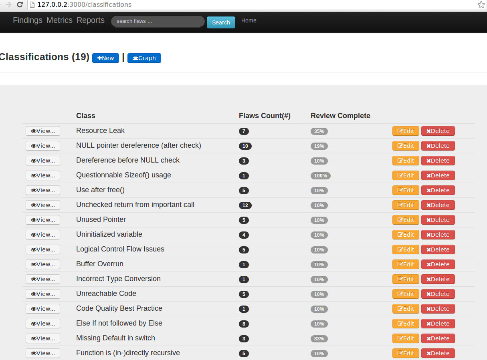
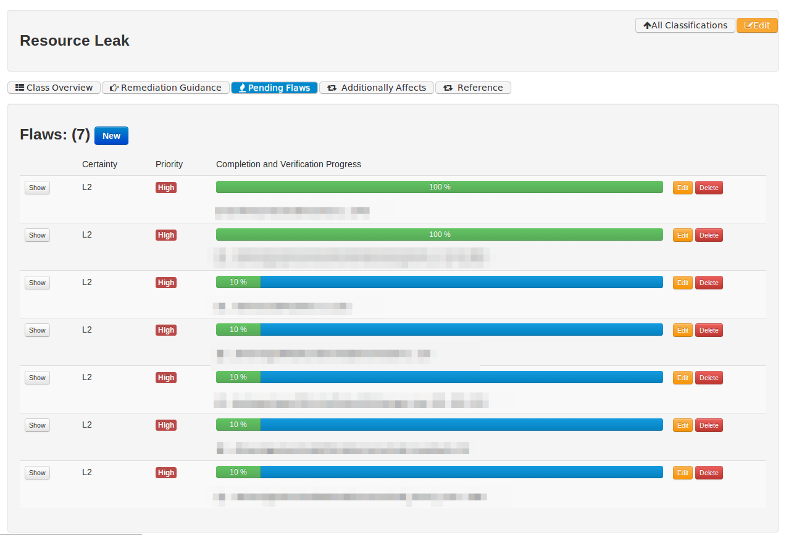
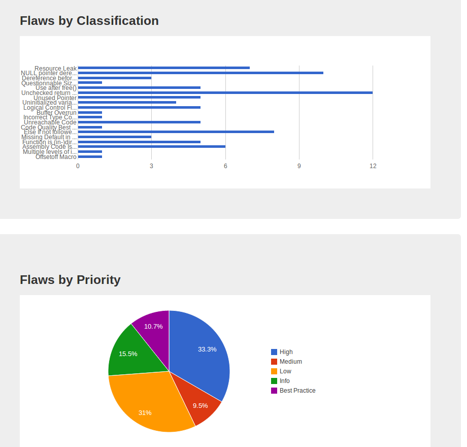
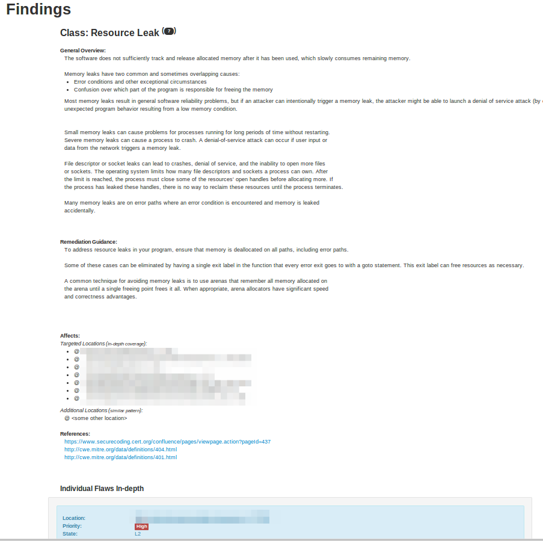

### Code Book App

#### Purpose: 
- to classify and organize manual findings from code reviews
- to run some metrics for them
- to have control over report generation
- to have search capabilities
- to free analyst from specific tools and their rigid report structure
- (future) to be able to extend the framework to dynamic test resutls and correlation

### Pre-Requisites:
- - - 
#### Update RVM:
`rvm get stable`
 
##### List known rubies
`rvm list known`

##### Say we want the most recent patch in MRI rubies
( [ruby-]2.0.0[-p247] )

##### Install ruby
`rvm install 2.0.0`

##### use your ruby
`rvm use ruby-2.0.0`

##### to check version of ruby used 
(ruby 2.0.0p247 (2013-06-27 revision 41674) [x86_64-linux])

`ruby -v`

##### create a separate gemset for your application
`rvm gemset create codebook`

gemset created codebook    => ~/.rvm/gems/ruby-2.0.0-p247@codebook

##### switch to your gemset
`rvm gemset use codebook`

_Using ruby-2.0.0-p247 with gemset codebook_

very few default gems are available out of the box

##### Install rails
`gem install rails --version '4.0.0' --no-ri --no-rdoc`

this will install bunch of dependencies and gems for rails 4

##### You can create your ProjectName directory
`mkdir ~/ProjectName; cd ~/ProjectName`

### Setup 
- - - 
#####  Clone the remote GIT repository to local
`git clone https://github.com/dsnezhkov/codebook.git`

`cd codebook`

##### run  setup. you may need to have git-core installed on your machine (apt-get install git-core) before runing setup

`./setup.sh`

What it does:

    + pulls this repo to local filesystem
    + populates DB
    + sets up SOLR for search across models
    

### Run
- - -
##### Start the app:

###### every time  you need to make sure the search is running. Run:
`./start_solr.sh`

###### then start the app
`rails s`

this wil start the app on [http://127.0.0.1:3000](http://127.0.0.1:3000)

### Usage and Features

**Notes:**
 - when first time editing and deleting classification categories and flaws you will be asked to authenticate. This is not a security measure by any means (user:admin, password: password), this is done purely so you don't inadvertently delete or modify things if what you mean is a read-only. This setup will go away when robust user logons with roles implemented.
 - this code has no verification yet. This is a single user workbook. Do not put it out on the public internet, it is not meant to serve teams (yet). This is also not a production grade code , and is based on sqlite for ease and portability.
 - If you need to share your findings you can rake db:load:data to attach the database.
 - participation to extend and improve the code is more than welcome.
 

###### View screenshots

- - -

- - -

- - -

- - -
